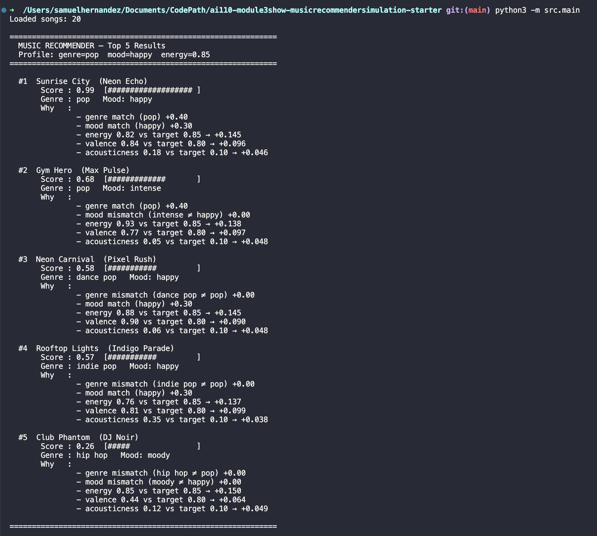
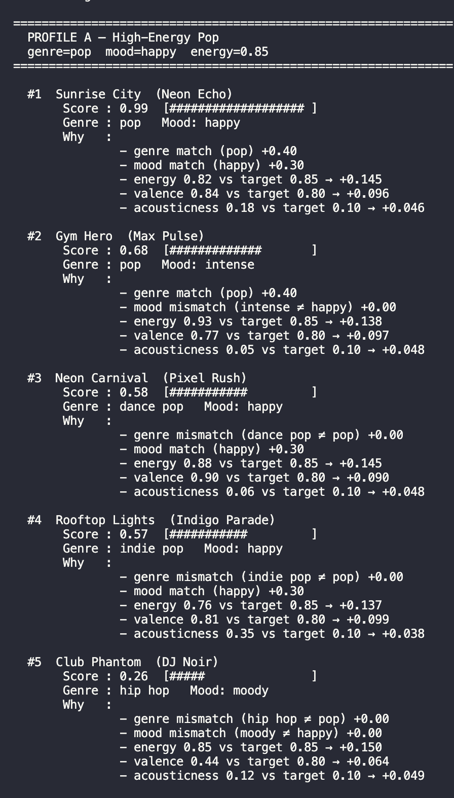
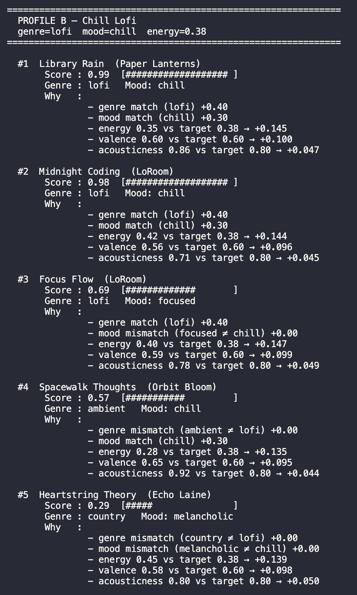
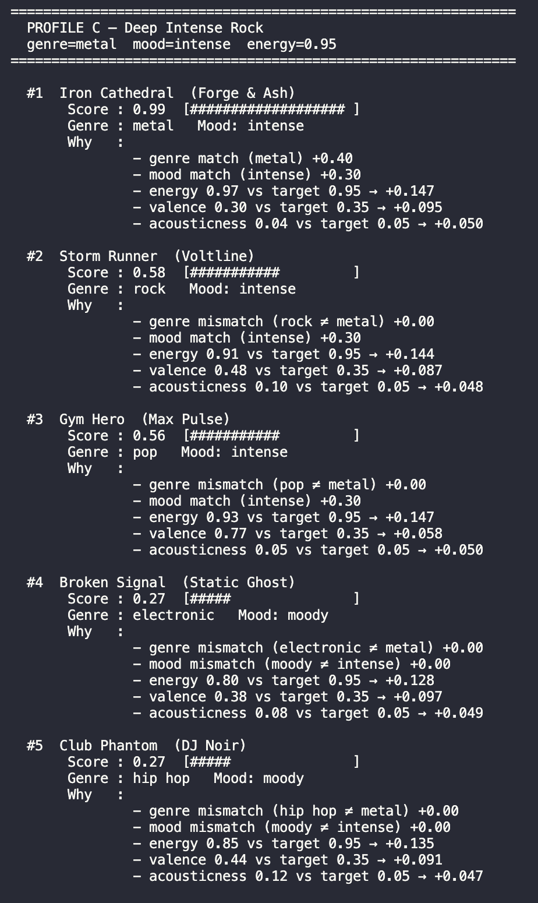
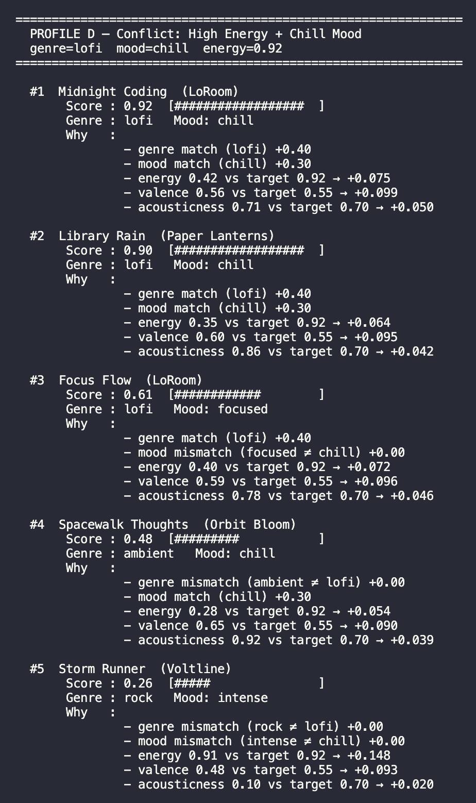
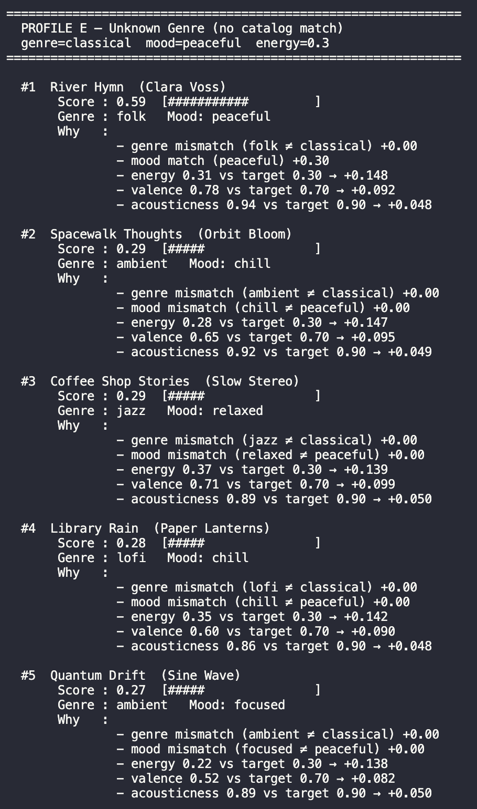
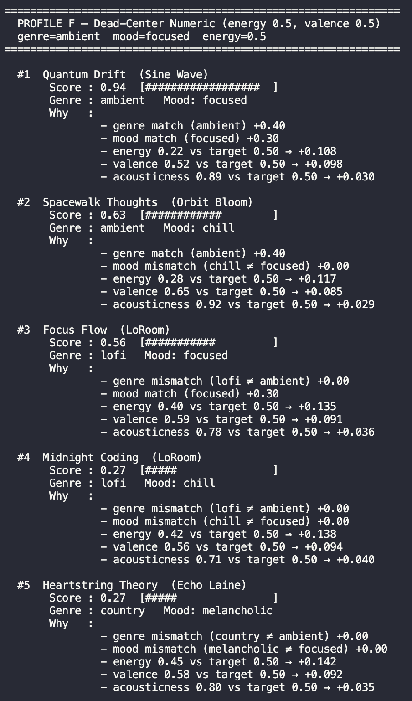

# 🎵 Music Recommender Simulation

## Project Summary

In this project you will build and explain a small music recommender system.

Your goal is to:

- Represent songs and a user "taste profile" as data
- Design a scoring rule that turns that data into recommendations
- Evaluate what your system gets right and wrong
- Reflect on how this mirrors real world AI recommenders

This simulation implements a content-based music recommender that scores each song in the catalog against a user's stated preferences and returns the top matches. Rather than relying on what other users listen to, it focuses entirely on song attributes — genre, mood, and energy — to find songs that fit a specific vibe. It is designed to be transparent: every recommendation includes a plain-language explanation of exactly why that song was chosen.

---

## How The System Works

Real-world recommenders like Spotify combine two strategies: **collaborative filtering** (finding users who share your taste and borrowing their discoveries) and **content-based filtering** (analyzing the actual audio attributes of songs). This simulation focuses on content-based filtering — the system never looks at what other users do; it only compares song attributes to your stated preferences. Each song receives a weighted score and the top `k` results are returned with an explanation.

See [docs/flowchart.md](docs/flowchart.md) for a visual diagram of the full data pipeline.

---

### Algorithm Recipe

The recommender runs in three stages:

1. **Load** — `load_songs()` reads `data/songs.csv` and returns a list of song dicts.
2. **Score** — for every song in the catalog, `score_song()` computes a single float (0.0–1.0) by comparing the song's attributes to the user's preferences using weighted proximity.
3. **Rank** — `recommend_songs()` sorts all scored songs descending and returns the top `k` with an explanation string.

#### Scoring Formula

```
score = (0.40 × genre_match)
      + (0.30 × mood_match)
      + (0.15 × energy_proximity)
      + (0.10 × valence_proximity)
      + (0.05 × acousticness_proximity)

where:
  genre_match   = 1.0 if song.genre == user.genre else 0.0
  mood_match    = 1.0 if song.mood  == user.mood  else 0.0
  proximity     = 1.0 - abs(user_value - song_value)   [for numeric features]
```

#### Weight Rationale

| Feature | Weight | Why this weight |
|---|---|---|
| `genre` | 0.40 | Hardest stylistic boundary — a folk fan and a metal fan share almost nothing |
| `mood` | 0.30 | Strong signal within genre — "chill" vs "intense" is often make-or-break |
| `energy` | 0.15 | Numeric fine-tuning within a matching mood and genre |
| `valence` | 0.10 | Separates emotionally bright songs from dark/moody ones |
| `acousticness` | 0.05 | Textural preference — the most situational and personal signal |

Weights sum to **1.0**, so the final score is always interpretable as a percentage match (e.g. 0.95 = 95% fit).

---

### Expected Biases and Limitations

- **Genre over-dominates low-catalog edge cases.** With only 20 songs, a user whose preferred genre appears only once (e.g. reggae) will almost always get that one song as #1 regardless of how poorly its mood or energy matches. In a real catalog of millions, this self-corrects.
- **Mood categories are coarse.** "Chill" covers very different feelings across lofi, ambient, and jazz. Two songs can share the same mood label while sounding nothing alike — the system treats them as equally matching.
- **No diversity enforcement.** The ranking rule always returns the closest matches, which means it may return 5 nearly identical songs. A real recommender injects variety to prevent filter bubbles.
- **Genre and mood require exact string matches.** A user who types `"Hip-Hop"` instead of `"hip hop"` scores 0 on genre for every song, even Club Phantom. The system has no fuzzy matching.
- **Numeric features assume linear preference.** `energy_proximity = 1 - |diff|` treats the relationship as a straight line. In reality, a user may tolerate energy slightly above their target more than energy below it — the formula cannot express that asymmetry.

---

### Song Features

Each `Song` object stores:

| Feature | Type | Description |
|---|---|---|
| `id` | int | Unique identifier |
| `title` | str | Song name |
| `artist` | str | Artist name |
| `genre` | str | e.g. pop, lofi, rock, metal, r&b, folk |
| `mood` | str | e.g. happy, chill, intense, moody, focused, romantic |
| `energy` | float 0–1 | Overall intensity (low = calm, high = driving) |
| `tempo_bpm` | float | Beats per minute |
| `valence` | float 0–1 | Emotional positivity (low = dark, high = upbeat) |
| `danceability` | float 0–1 | Rhythmic feel and beat regularity |
| `acousticness` | float 0–1 | Organic/acoustic vs electronic/produced |

### UserProfile Features

Each `UserProfile` stores:

| Field | Type | Description |
|---|---|---|
| `favorite_genre` | str | The genre the user most wants to hear |
| `favorite_mood` | str | The mood or vibe the user is in |
| `target_energy` | float 0–1 | Desired energy level (e.g. 0.85 = high-energy) |
| `target_valence` | float 0–1 | Desired emotional tone (e.g. 0.80 = upbeat) |
| `target_acousticness` | float 0–1 | Texture preference (e.g. 0.10 = electronic) |
| `likes_acoustic` | bool | Convenience flag — true if acousticness target > 0.5 |

---

## Getting Started

### Setup

1. Create a virtual environment (optional but recommended):

   ```bash
   python -m venv .venv
   source .venv/bin/activate      # Mac or Linux
   .venv\Scripts\activate         # Windows

2. Install dependencies

```bash
pip install -r requirements.txt
```

3. Run the app:

```bash
python -m src.main
```

### Running Tests

Run the starter tests with:

```bash
pytest
```

You can add more tests in `tests/test_recommender.py`.

---

## Terminal Output







